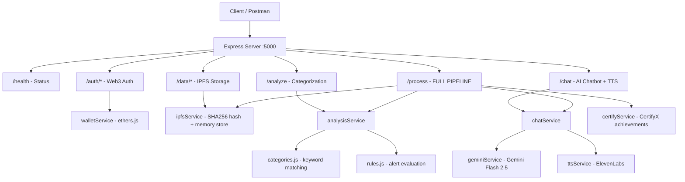

# FinPilot Backend - Complete Implementation Walkthrough

## Summary

Built a fully functional, hackathon-ready Node.js + Express backend for the **AI Financial Assistant (FinPilot)** with all 7 API endpoints working and tested.

---

## Architecture



---

## Files Created/Modified

### Entry Point
| File | Action | Description |
|------|--------|-------------|
| [index.js](file:///c:/Users/David%20Tembhare/Desktop/Finpilot/Backend/index.js) | Modified | Main server with all route wiring, health check, 404 handler |
| [package.json](file:///c:/Users/David%20Tembhare/Desktop/Finpilot/Backend/package.json) | Modified | Added `start` and `dev` scripts |
| [.env](file:///c:/Users/David%20Tembhare/Desktop/Finpilot/Backend/.env) | Modified | `ELEVEN_API_KEY`, `GEMINI_API_KEY`, `PORT` |

---

### Routes (5 files)
| File | Endpoint | Description |
|------|----------|-------------|
| [auth.js](file:///c:/Users/David%20Tembhare/Desktop/Finpilot/Backend/routes/auth.js) | `GET /auth/message`, `POST /auth/verify` | Web3 wallet authentication |
| [data.js](file:///c:/Users/David%20Tembhare/Desktop/Finpilot/Backend/routes/data.js) | `POST /data/store`, `GET /data/:hash` | IPFS store & retrieve |
| [analyze.js](file:///c:/Users/David%20Tembhare/Desktop/Finpilot/Backend/routes/analyze.js) | `POST /analyze` | Transaction categorization + alerts |
| [chat.js](file:///c:/Users/David%20Tembhare/Desktop/Finpilot/Backend/routes/chat.js) | `POST /chat` | AI chatbot + optional TTS |
| [process.js](file:///c:/Users/David%20Tembhare/Desktop/Finpilot/Backend/routes/process.js) | `POST /process` | **Full pipeline** (IPFS → Analyze → AI → TTS → CertifyX) |

---

### Services (7 files)
| File | Purpose |
|------|---------|
| [walletService.js](file:///c:/Users/David%20Tembhare/Desktop/Finpilot/Backend/services/walletService.js) | MetaMask signature verification via ethers.js |
| [ipfsService.js](file:///c:/Users/David%20Tembhare/Desktop/Finpilot/Backend/services/ipfsService.js) | IPFS-like storage with SHA256 hashes + in-memory store |
| [analysisService.js](file:///c:/Users/David%20Tembhare/Desktop/Finpilot/Backend/services/analysisService.js) | Orchestrates categorization + alert evaluation |
| [geminiService.js](file:///c:/Users/David%20Tembhare/Desktop/Finpilot/Backend/services/geminiService.js) | Gemini Flash 2.5 API integration with mock fallback |
| [chatService.js](file:///c:/Users/David%20Tembhare/Desktop/Finpilot/Backend/services/chatService.js) | Prompt building + Gemini orchestration |
| [ttsService.js](file:///c:/Users/David%20Tembhare/Desktop/Finpilot/Backend/services/ttsService.js) | ElevenLabs TTS (returns base64 audio) |
| [certifyService.js](file:///c:/Users/David%20Tembhare/Desktop/Finpilot/Backend/services/certifyService.js) | CertifyX achievement system (5 achievements) |

---

### Utils (3 files)
| File | Purpose |
|------|---------|
| [categories.js](file:///c:/Users/David%20Tembhare/Desktop/Finpilot/Backend/utils/categories.js) | 11 category keyword mappings for transaction classification |
| [rules.js](file:///c:/Users/David%20Tembhare/Desktop/Finpilot/Backend/utils/rules.js) | 6 alert rules (food, subscriptions, transport, shopping, entertainment, savings) |
| [promptBuilder.js](file:///c:/Users/David%20Tembhare/Desktop/Finpilot/Backend/utils/promptBuilder.js) | Structured prompt templates for insight + chat modes |

### Middleware
| File | Purpose |
|------|---------|
| [errorHandler.js](file:///c:/Users/David%20Tembhare/Desktop/Finpilot/Backend/middleware/errorHandler.js) | Global error handler + async route wrapper |

---

## API Endpoints Quick Reference

| Method | Endpoint | Input | Output |
|--------|----------|-------|--------|
| `GET` | `/health` | — | Server status, uptime, endpoint list |
| `GET` | `/auth/message` | — | Signing message + timestamp |
| `POST` | `/auth/verify` | `{ address, signature }` | Verification result |
| `POST` | `/data/store` | `{ transactions, wallet? }` | IPFS hash |
| `GET` | `/data/:hash` | URL param | Stored JSON data |
| `POST` | `/analyze` | `{ transactions }` | Totals, alerts, summary |
| `POST` | `/chat` | `{ message, data?, alerts? }` | AI reply + optional audio |
| `POST` | `/process` | `{ wallet, transactions }` | **Full pipeline result** |

---

## Testing Results

All endpoints verified working locally:

- ✅ `GET /health` → returns server status with endpoint list
- ✅ `GET /auth/message` → returns signing message
- ✅ `POST /analyze` → categorizes 11 transaction types, triggers 3 alerts for test data
- ✅ `POST /chat` → returns AI-powered financial advice
- ✅ `POST /data/store` + `GET /data/:hash` → stores and retrieves IPFS data
- ✅ `POST /process` → full pipeline with IPFS hash, totals, alerts, AI insight, certificates

---

## How to Run

```bash
cd Backend
npm install
npm run dev     # with nodemon (hot reload)
# or
npm start       # production mode
```

> [!TIP]
> Add your real API keys in `.env` for Gemini AI and ElevenLabs TTS. Without keys, the system uses intelligent mock responses — perfect for demo!
